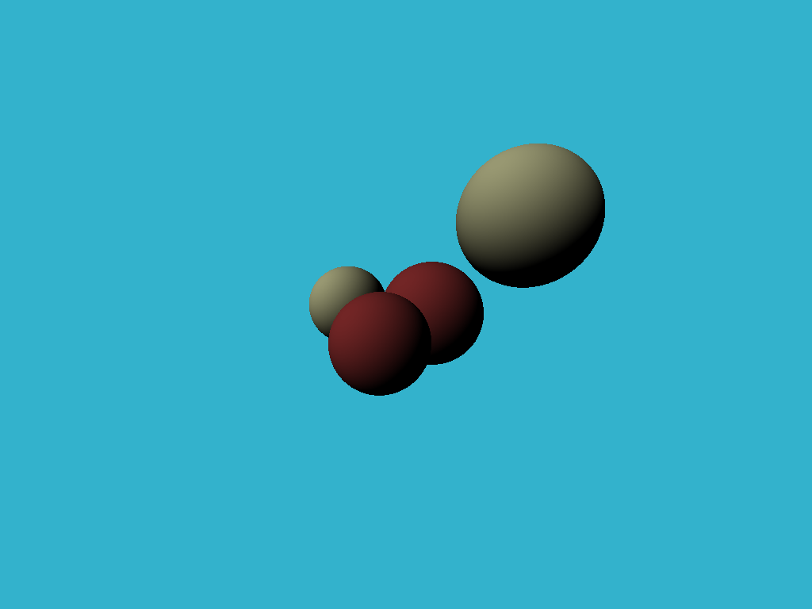

Tiny Raytracer
==============

My attempt at following [tinyraytracer](https://github.com/ssloy/tinyraytracer/wiki), but in Rust instead of C++. I don't know much about C++, Rust or Raytracing, so this should be interesting 🐼

## Current render

_Converted from .PPM to .PNG_
